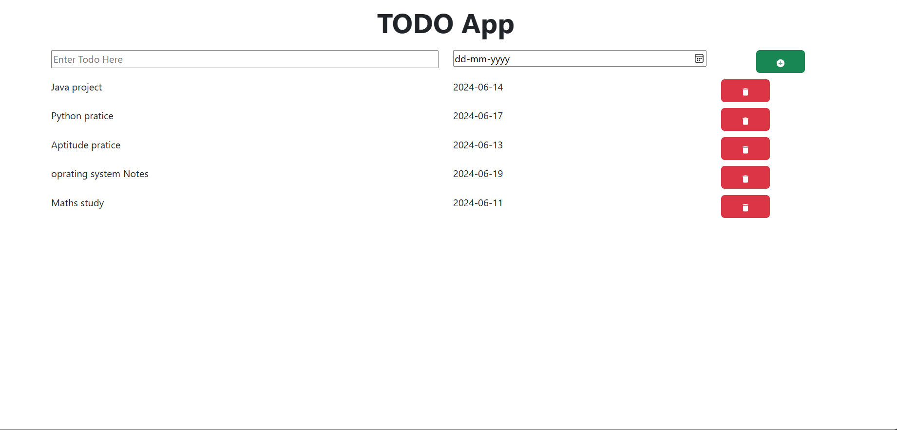

# Todo Application

This project is a Todo application built using React. It helps users manage their tasks efficiently by providing an intuitive interface to add,delete, and mark tasks as completed.

## Project Overview

The Todo application is designed to be a simple yet powerful tool for task management. It offers a user-friendly interface and essential features to help users stay organized and productive.

## Features

- Add new tasks
- Delete tasks

## Technologies Used

- **React**: For building the user interface.
- **JavaScript**: For application logic.
- **CSS**: For styling the components.

## Screenshot

